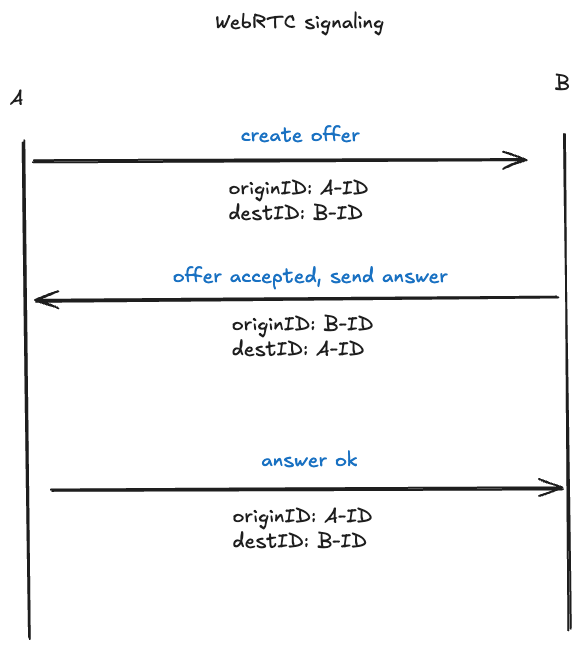

# Journey of Learning WebRTC with Go & JavaScript



This repository documents my **journey of learning WebRTC** using a Go backend (Pion WebRTC, Gorilla WebSocket, mux) and HTML/JavaScript frontend.  
The main goal is to understand signaling concepts, relay, and implement a simple video conference from scratch.

---

## Features

- Signaling server with Go (WebSocket)
- Simple room & peer management
- Video relay between browsers (SFU-lite)
- Easy-to-understand HTML/JS client code

---

## How to Run

1. **Run the Go server:**
   ```sh
   make run
   ```
   The server will run at [http://localhost:8000](http://localhost:8000)

2. **Open your browser** at `http://localhost:8000/`
3. **Join a room** with your name & room ID (you can share the room ID with friends)
4. **Try opening from another tab/browser** to simulate multi-user

---

## Dependencies

- [Pion WebRTC](https://github.com/pion/webrtc)
- [Gorilla WebSocket](https://github.com/gorilla/websocket)
- [Gorilla Mux](https://github.com/gorilla/mux)

---

## License

MIT

---

> _This repository was created as personal documentation and practice.  
> Hopefully, it will be useful for friends who also want to learn WebRTC from scratch!_